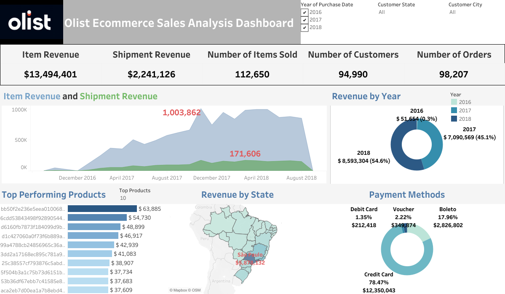

# Olist-data-analysis-project
A Medallion-style warehouse (Bronze → Silver → Gold) for the Olist Brazilian e-commerce dataset. Focused on realistic ETL, standardization, quality validation, and Tableau-ready marts.

## Dataset
Source: [Olist Brazilian E-Commerce](https://www.kaggle.com/datasets/olistbr/brazilian-ecommerce)

Scope: Orders, Order Items, Payments, Reviews, Customers, Sellers, Products, Geolocation

Note: Tableau Public export via CSV (no live SQL Server connection)

## Architecture
### Bronze (Raw)
Ingestion: BULK INSERT (CSV)
Policy: loaded “as-is” (no renaming/cleaning)

### Silver (Cleaned/Standardized)
Text: TRIM, non-breaking space cleanup

Dates: TRY_CONVERT(datetime2, …)

Geolocation: deduped to 1 row per (zip_code_prefix, state) with averaged lat/long

Orders: logical validations (e.g., date inconsistencies flag)

Integrity: PK uniqueness + Foreign Key coverage checks across all Silver tables

### Gold (Views; Tableau-ready)
#### Dimensions:
dim_customers (1 row/customer_id, identity + geography + order lifecycle aggregates)

dim_sellers (1 row/seller_id, identity + geography; KPIs in a separate view)

dim_products (1 row/product_id; currently behavior-based features from order_items)

dim_payment_methods (1 row/order_id & payment_method)

#### Facts (as views):
fact_order_items (atomic sales; price, freight)

fact_orders (order-level KPIs, SLAs, roll-ups, timestamps)

## Tableau
Data source: exported CSVs from Gold views (documented column order + types)

[Ecommerce Sales Dashboard](https://public.tableau.com/app/profile/panda.data5916/viz/Olist_Project_17645703081230/EcommerceSalesDashboard?publish=yes)

