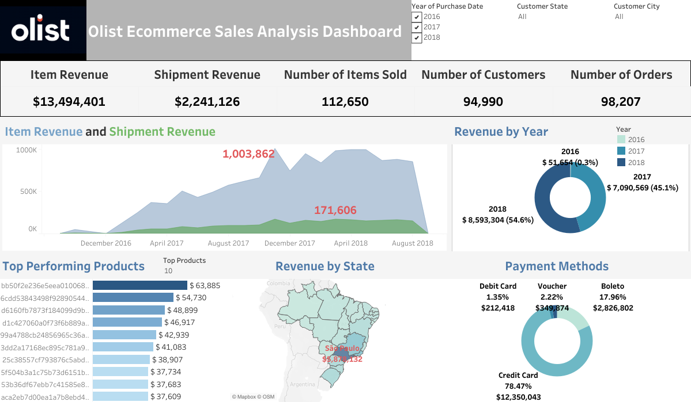

# Olist E-Commerce Data Warehouse & Sales Dashboard

[View the interactive Tableau dashboard](https://public.tableau.com/app/profile/panda.data5916/viz/Olist_Project_17645703081230/EcommerceSalesDashboard?publish=yes)

An end-to-end SQL Server analytics project that turns the public Olist Brazilian e-commerce dataset into analysis-ready sales, customer, seller, product, and payment marts. I built the pipeline using a Medallion architecture (Bronze → Silver → Gold) and used Tableau to surface commercial and delivery-performance trends.



## What this project demonstrates

- Designed a layered warehouse that keeps raw source data separate from cleaned and presentation-ready data.
- Built idempotent SQL Server DDL and stored procedures for loading nine source files.
- Standardized text and timestamps, aggregated payments, and deduplicated geographic data before modeling analytics views.
- Created Gold-layer views at the order, order-item, customer, seller, product, and payment-method grains.
- Delivered an interactive Tableau dashboard with time, customer-state, and customer-city filters.

## Results at a glance

The dashboard summarizes 2016–2018 Olist activity:

| Metric | Result |
| --- | ---: |
| Item revenue | $13.49M |
| Freight revenue | $2.24M |
| Orders | 98,207 |
| Items sold | 112,650 |
| Customers | 94,990 |
| 2018 share of revenue | 54.6% |

The dashboard also makes it easy to compare revenue by period and geography, inspect the highest-revenue products, and understand payment-method mix.

## Architecture

```text
Olist CSV files
     │
     ▼
Bronze: raw CSV ingestion
     │
     ▼
Silver: cleaned, typed, deduplicated tables
     │
     ▼
Gold: Tableau-ready analytical views
     │
     ▼
Tableau dashboard
```

### Data layers

| Layer | Purpose | Examples |
| --- | --- | --- |
| Bronze | Preserve source-shaped records loaded from CSV | `bronze.orders`, `bronze.order_items` |
| Silver | Clean and standardize data for dependable joins | typed dates, normalized payment labels, ZIP-level geolocation deduplication |
| Gold | Provide business-friendly, analysis-ready views | `fact_orders`, `fact_order_items`, `dim_customers`, `dim_sellers`, `dim_products` |

## Data model and assumptions

- `fact_orders` is one row per order, with item revenue, freight, and total order value.
- `fact_order_items` is one row per order/product/seller combination, with quantity and per-item economics.
- Customer and seller views retain geographic attributes and performance measures; product metrics are calculated from observed sales activity.
- Payment records are aggregated by order and payment type in Silver. Consequently, `avg_payment_installments` is an order/payment-type average, not an individual-payment record.
- Delivery timestamps are preserved as supplied. Date-quality checks should be performed before interpreting delivery SLAs.

## Tech stack

SQL Server · T-SQL · SQL Server Management Studio · Tableau Public · CSV

## Run the project

### Prerequisites

- SQL Server and SQL Server Management Studio (SSMS)
- The CSV files in `datasets/` available to the SQL Server service account
- Tableau Desktop or Tableau Public (optional, for dashboard exploration)

### Load order

1. In SSMS, enable **Query → SQLCMD Mode** and define `DATASET_PATH` as the absolute directory that contains the CSV files. For example: `:setvar DATASET_PATH "C:\\OlistData"`.
2. Run `sql_scripts/init_db.sql`.
3. Run `sql_scripts/bronze/ddl_bronze` and then `sql_scripts/bronze/proc_load_bronze.sql`.
4. Run `EXEC bronze.load_bronze;`.
5. Run `sql_scripts/silver/ddl_silver.sql` and then `sql_scripts/silver/proc_load_silver.sql`.
6. Run `EXEC silver.load_silver;`.
7. Run every script in `sql_scripts/gold/` to create the presentation views.
8. Connect Tableau to exported Gold-view CSVs, or use the published dashboard above.

> `BULK INSERT` reads from the SQL Server host, so the dataset directory must be readable by the SQL Server service account.

## Repository layout

```text
datasets/                 Source Olist CSV files
dashboards/               Dashboard screenshot
sql_scripts/
  init_db.sql             Database and schema setup
  bronze/                 Raw-table DDL and CSV loader
  silver/                 Cleansing and standardization logic
  gold/                   Analytics-view definitions
```

## Data source

[Brazilian E-Commerce Public Dataset by Olist on Kaggle](https://www.kaggle.com/datasets/olistbr/brazilian-ecommerce). The data is used here for portfolio and educational purposes.

## Next improvements

- Add automated row-count, key-uniqueness, and referential-integrity checks after each load.
- Parameterize the database name and add orchestration for scheduled refreshes.
- Publish the Tableau workbook or data-extract definition alongside the dashboard image for full visual reproducibility.
